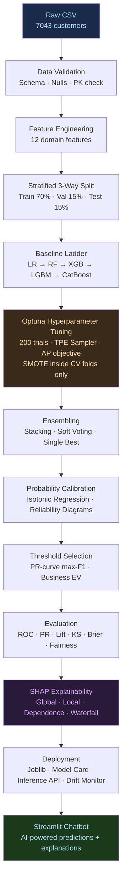
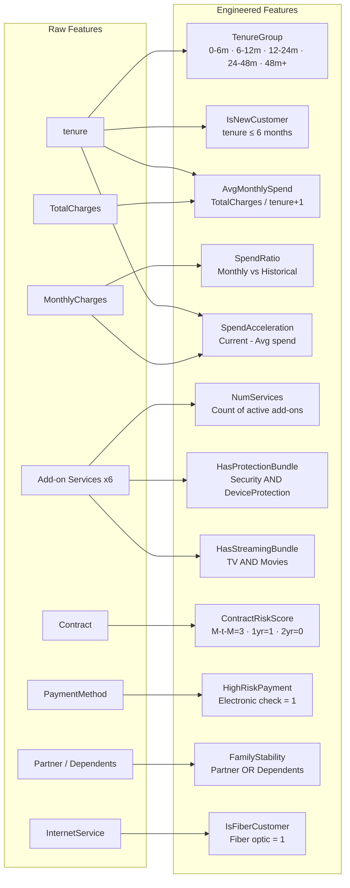
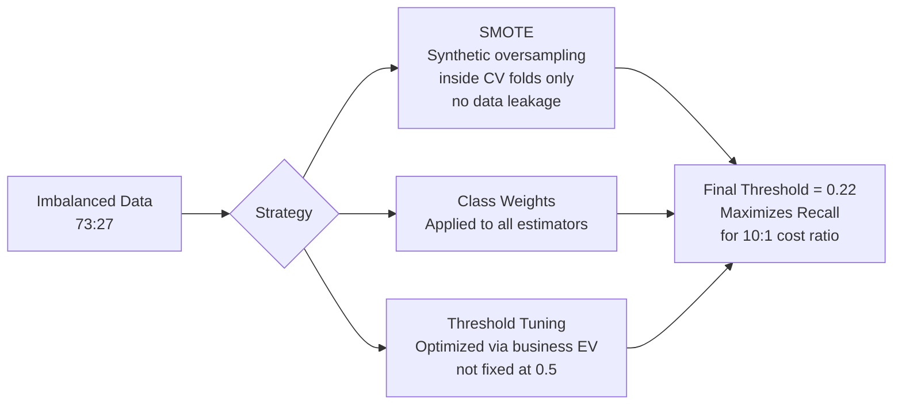
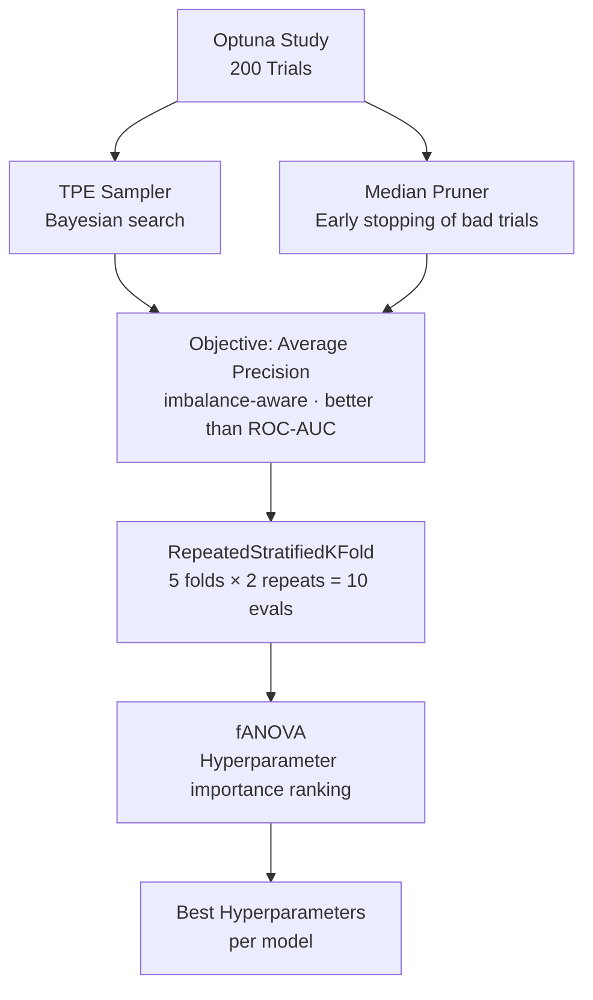
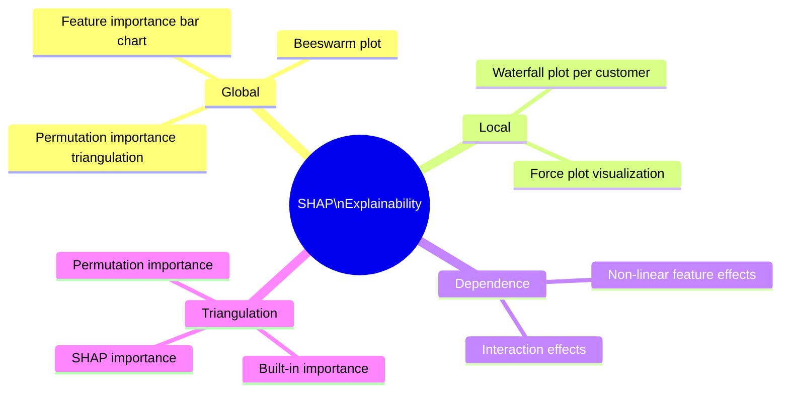
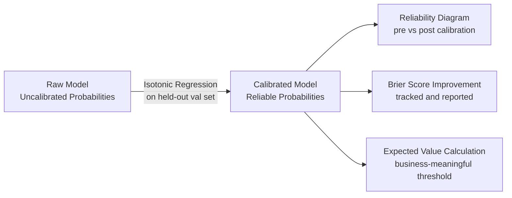
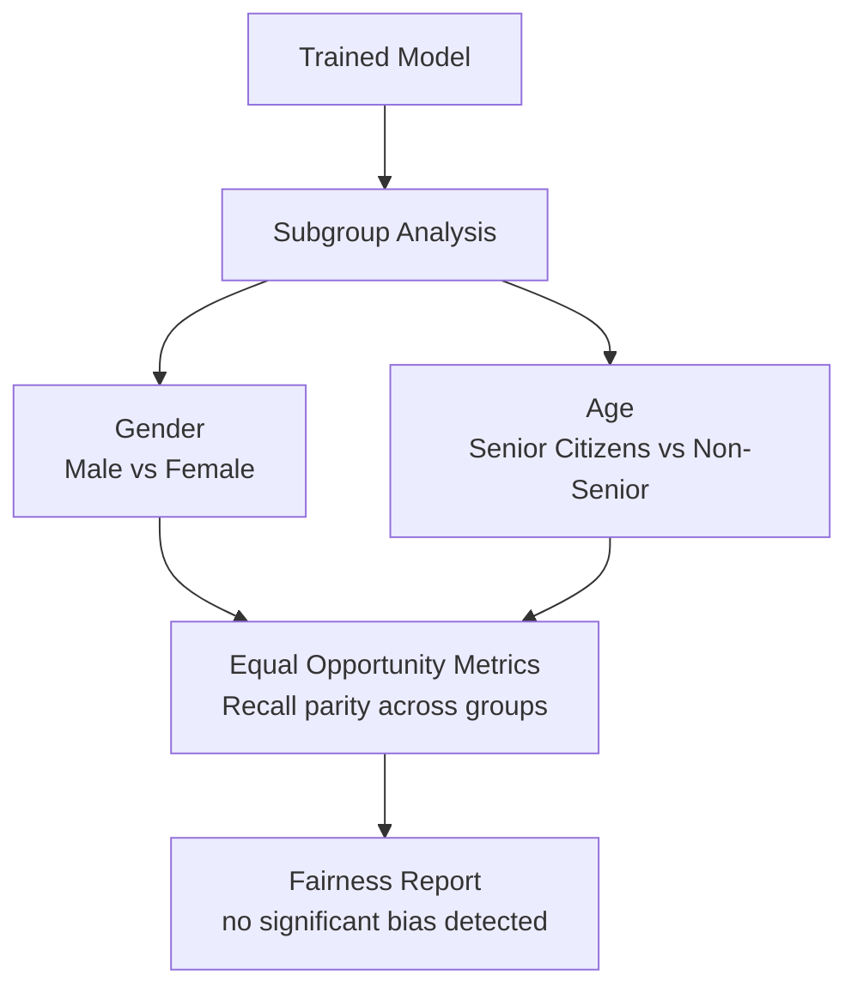
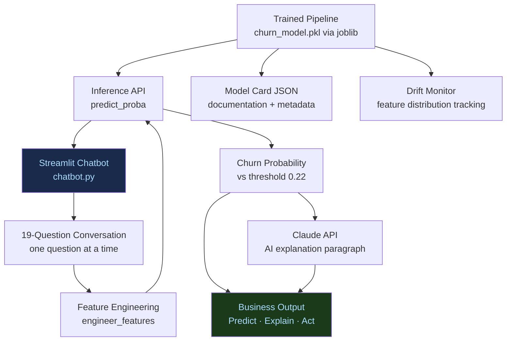
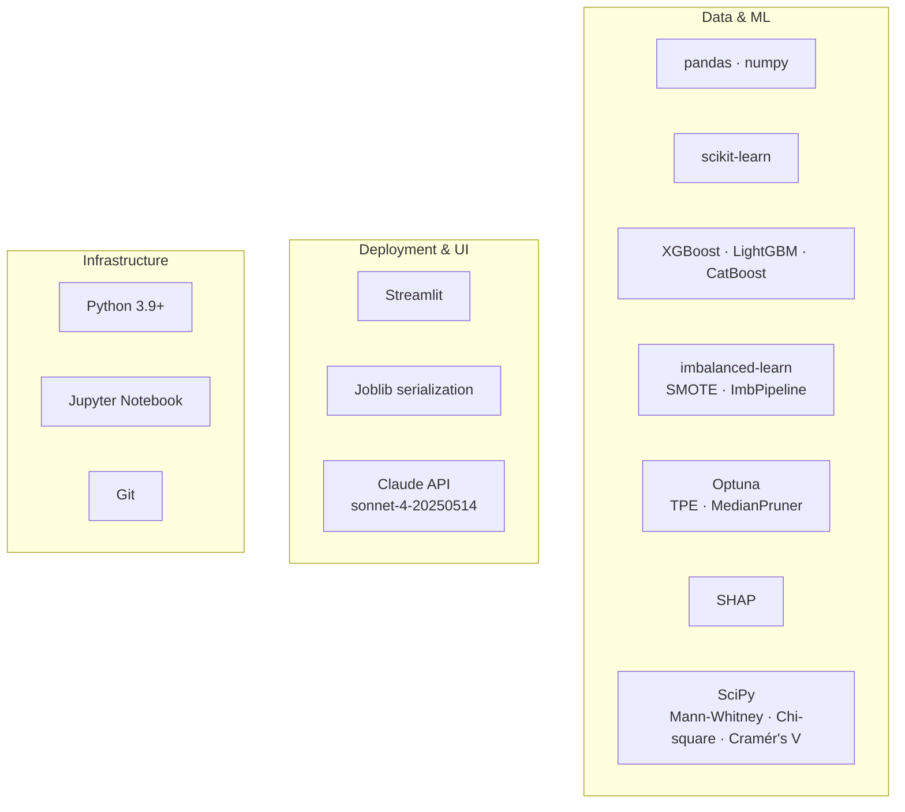

# Telco Customer Churn Prediction
### End-to-End Production-Grade Machine Learning Pipeline

---

## 1. Business Problem

Telecom companies lose **$500 in customer lifetime value** for every missed churner — yet a false alarm costs only **$50** in wasted retention offers.

```
Cost Asymmetry:  False Negative (missed churner) = $500
                 False Positive (wrong alarm)    =  $50
                 Ratio                           =  10 : 1
```

> **Goal:** Build a model that maximizes **Recall** — catching as many real churners as possible — while remaining profitable via Expected Value optimization.

| Business Metric | Value |
|---|---|
| Dataset size | 7,043 customers |
| Churn rate | ~26.5% |
| Avg. monthly revenue / customer | $64.76 |
| Retention success rate | 30% |

---

## 2. Pipeline Architecture



---

## 3. Feature Engineering

12 domain-driven features engineered from raw data:



---

## 4. Imbalance Handling Strategy

**Class ratio:** 73% No Churn : 27% Churn



> SMOTE is applied **inside** `ImbPipeline` during cross-validation only — never on the held-out test set.

---

## 5. Hyperparameter Tuning — Optuna



---

## 6. Model Comparison

| Model | ROC-AUC | Precision | Recall | F1 | EV / User |
|---|---|---|---|---|---|
| Single Best (Calibrated) | 0.8452 | 0.5179 | **0.8250** | **0.6364** | $0.1547 |
| Soft Voting (Calibrated) | 0.8469 | **0.5445** | 0.7643 | 0.6360 | $0.1374 |
| Stacking (Calibrated) | **0.8503** | 0.5369 | 0.7786 | 0.6356 | $0.1413 |

```mermaid
xychart-beta
    title "Model Performance Comparison"
    x-axis ["ROC-AUC", "Recall", "F1 Score", "Precision"]
    y-axis "Score" 0 --> 1
    bar [0.8452, 0.8250, 0.6364, 0.5179]
    bar [0.8469, 0.7643, 0.6360, 0.5445]
    bar [0.8503, 0.7786, 0.6356, 0.5369]
```



> **Winner: Single Best (Calibrated)** — highest Recall (0.825) and F1 (0.6364), best Expected Value per user ($0.15)

---

## 7. Final Model Metrics

```
┌─────────────────────────────────────────────┐
│           PRODUCTION MODEL SCORECARD        │
├──────────────────────┬──────────────────────┤
│  ROC-AUC             │  0.8503              │
│  Average Precision   │  0.6419              │
│  Recall              │  0.825               │
│  F1 Score            │  0.636               │
│  MCC                 │  0.490               │
│  Brier Score         │  0.134               │
│  Expected Value/User │  $0.15               │
│  Total Test-Set EV   │  $164                │
│  Production Threshold│  0.22                │
│  Test Set Size       │  1,057 customers     │
└──────────────────────┴──────────────────────┘
```

---

## 8. SHAP Explainability



**Top churn drivers identified by SHAP:**

1. `ContractRiskScore` — month-to-month customers churn 3× more than 2-year
2. `IsNewCustomer` — tenure ≤ 6 months = extremely high risk
3. `HighRiskPayment` — electronic check strongly correlates with churn
4. `IsFiberCustomer` — fiber optic customers churn despite paying premium
5. `NumServices` — low add-on engagement = higher churn probability

---

## 9. Probability Calibration



> Calibration ensures that a predicted 70% probability truly means the customer churns 70% of the time — critical for business decision-making.

---

## 10. Fairness Audit



---

## 11. Deployment Architecture



---

## 12. Chatbot Interface

The Streamlit chatbot provides a **conversational prediction interface**:

```
┌──────────────────────────────────────────────────┐
│          Churn Prediction Chatbot                │
│                                                  │
│  Bot: What is the customer's Contract type?      │
│       ┌─────────────┐ ┌──────────┐ ┌──────────┐ │
│       │Month-to-month│ │ One year │ │ Two year │ │
│       └─────────────┘ └──────────┘ └──────────┘ │
│                                                  │
│  ████████████████░░░░  Question 15/19            │
│                                                  │
│  ⚠️ PREDICTION: HIGH CHURN RISK                 │
│           73.4% Churn Probability                │
│                                                  │
│  💡 This customer has a 73.4% probability of     │
│  churning, driven primarily by their             │
│  month-to-month contract and short tenure...     │
└──────────────────────────────────────────────────┘
```

**Features:**
- 19 guided questions with clickable option buttons
- Real-time progress bar
- Churn probability with color-coded result card
- AI-generated explanation paragraph (Claude API)
- Customer summary table
- Supports multiple predictions per session

---

## 13. Tech Stack



---

## 14. Key Takeaways

| Aspect | Decision | Reason |
|---|---|---|
| Metric optimized | Average Precision | Better than ROC-AUC for imbalanced data |
| SMOTE placement | Inside CV folds only | Prevents data leakage |
| CV strategy | RepeatedStratifiedKFold (5×2) | Lower variance, preserves class ratio |
| Calibration method | Isotonic Regression | Better than Platt scaling for larger datasets |
| Threshold | 0.22 (not 0.5) | 10:1 cost asymmetry demands high Recall |
| Winner model | Single Best Calibrated | Highest Recall + F1 + EV per user |
| Explainability | SHAP (global + local) | Actionable business insights per customer |

---

*Dataset: IBM Telco Customer Churn · Model trained 2026-04-18 · Threshold: 0.22 · Test set: 1,057 customers*
